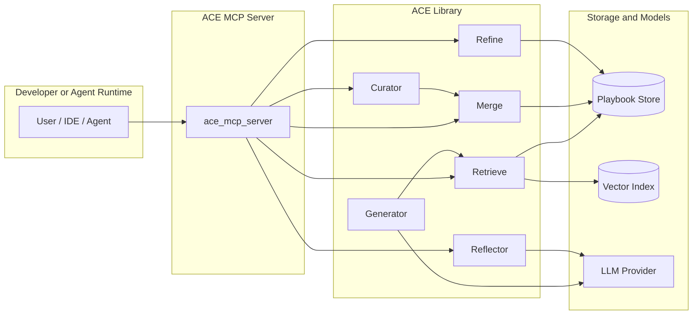
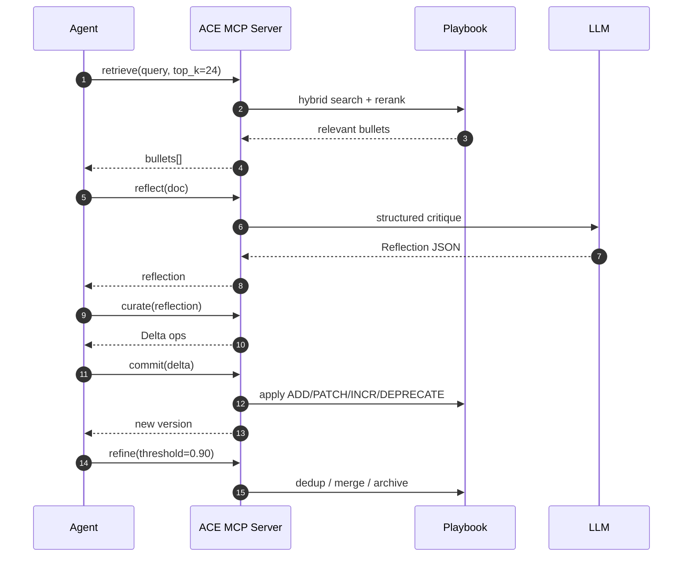

# ACE

ACE is a Python library and MCP server for agentic context engineering: retrieve the right playbook bullets, learn from execution feedback, and evolve context through small deterministic deltas instead of rewriting prompts from scratch.

The project implements the loop described in the paper [Agentic Context Engineering](docs/Agentic%20Context%20Engineering.pdf): Generator -> Reflector -> Curator -> Merge -> Refine.

If you want to try ACE without running it locally, a hosted version is available at [aceagent.io](https://aceagent.io).

## Why ACE

- Treat context as a versioned playbook, not a monolithic system prompt.
- Retrieve reusable tactics with hybrid lexical + vector search.
- Convert task outcomes into strict JSON reflections and deltas.
- Apply updates deterministically in code.
- Expose the whole workflow over MCP for IDEs, coding agents, and other clients.

## Architecture

The visuals below are adapted from the diagrams in [`docs/arch-diagrams/`](docs/arch-diagrams).





## Current Capabilities

- `ace retrieve`: hybrid retrieval over playbook bullets.
- `ace reflect`: generate structured reflections from task feedback.
- `ace curate`: convert reflections into delta operations.
- `ace commit`: deterministically apply deltas and bump playbook version.
- `ace evolve`: run reflect -> curate -> commit from an explicit task document.
- `ace pipeline`: either run the built-in generator loop or process external execution feedback with `--feedback`.
- `ace refine`: merge near-duplicates and archive low-utility bullets.
- `ace serve`: start the FastAPI serving layer with `/health`, `/retrieve`, `/feedback`, `/stats`, `/metrics`, `/playbook`, `/playbook/view`, and `/playbook/version`.
- `python -m ace_mcp_server`: expose the `ace_*` tool surface over FastMCP.

## Quickstart

For the shortest end-to-end setup path, see [QUICKSTART.md](QUICKSTART.md).

```bash
python3 -m venv .venv
source .venv/bin/activate
pip install -U pip
pip install -e .[dev]
make test
```

Seed a local playbook and inspect it:

```bash
make seed
ace stats --json
ace retrieve "hybrid retrieval for code agents" --top-k 5
```

Run the full reflect -> curate -> commit loop against a task document:

```bash
ace evolve --doc task.json --print-delta --apply
```

Start the MCP server:

```bash
python -m ace_mcp_server
```

Start the HTTP server and open the playbook viewer:

```bash
ace serve --host 127.0.0.1 --port 8000
# then visit http://127.0.0.1:8000/playbook/view
```

Notes:

- Python 3.11+ is required.
- The CLI loads `configs/default.toml` and supports `ACE_*` / `MCP_*` environment overrides.
- Reflection and curation use the configured LLM provider. The default config points at the OpenAI client stack.
- The seed script writes seed bullets into the local default store path (`ace.db`).

## CLI Surface

```bash
ace version
ace retrieve "pgvector migration" --top-k 8
ace reflect --doc task.json --json
ace curate --reflection reflection.json --json
ace commit --delta delta.json --json
ace pipeline "triage flaky retrieval test" --dry-run --json
ace refine --threshold 0.90 --dry-run --json
ace stats --json
ace serve --host 127.0.0.1 --port 8000
ace train --data ace/eval/fixtures/labeled_samples.jsonl --epochs 1 --json
ace eval run --suite all --format text
ace smoke-test-model --json
```

## MCP Quickstart

ACE exposes these MCP tools:

- `ace_retrieve`
- `ace_record_trajectory`
- `ace_reflect`
- `ace_curate`
- `ace_commit`
- `ace_refine`
- `ace_stats`
- `ace_pipeline`

Resource:

- `ace://playbook.json`

Claude Desktop example:

```json
{
  "mcpServers": {
    "ace": {
      "command": "python",
      "args": ["-m", "ace_mcp_server"],
      "cwd": "/path/to/ACE",
      "env": {
        "ACE_DB_URL": "sqlite:///ace.db"
      }
    }
  }
}
```

## Implementation Notes

- The built-in generator is a small ReAct-style loop with a default simulated tool executor. For real execution feedback from CI, editors, or external agents, use `ace reflect`, `ace evolve`, or `ace pipeline --feedback`.
- Merge remains deterministic and code-driven. LLM-backed components propose reflections and candidate deltas; they do not rewrite the playbook directly.
- The MCP server and the FastAPI serving layer are separate entrypoints: `python -m ace_mcp_server` for MCP, `ace serve` for HTTP.

## Repository Map

```text
ace/               core library: schema, retrieval, merge, reflection, curation, refine
ace_mcp_server/    FastMCP wrapper and entrypoint
tests/             unit and integration coverage
eval/              smoke benchmarks and evaluation harness
configs/           default configuration and env-driven overrides
docs/              architecture, API reference, MCP usage, paper
```

## Documentation

- [Getting started example](docs/getting-started-example.md)
- [Custom LLM provider example](docs/custom-llm-provider-example.md)
- [Proof demo asset](docs/ace-proof-demo.md)
- [Configuration guide](docs/configuration.md)
- [API reference](docs/api-reference.md)
- [MCP usage guide](docs/MCP_USAGE_GUIDE.md)
- [Smoke test usage](docs/smoke-test-usage.md)
- [Architecture diagrams](docs/arch-diagrams)
- [Evaluation notes](eval/README.md)

## Development

```bash
make setup
make lint
make type
make test
make bench
make baseline
```

ACE is still early-stage. The focus is correctness, deterministic playbook updates, and small verifiable improvements backed by tests.
