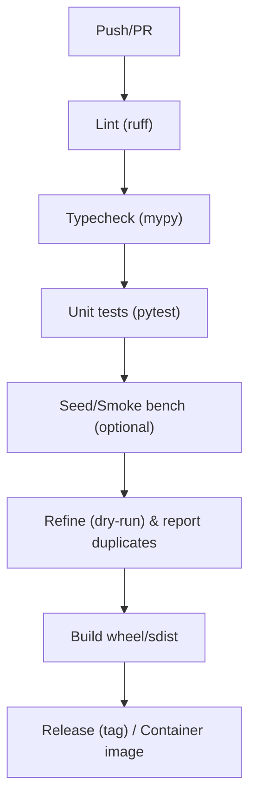

```mermaid
flowchart TB
  P["Push/PR"] --> L["Lint (ruff)"]
  L --> T["Typecheck (mypy)"]
  T --> U["Unit tests (pytest)"]
  U --> S["Seed/Smoke bench (optional)"]
  S --> R["Refine (dry-run) & report duplicates"]
  R --> PKG["Build wheel/sdist"]
  PKG --> REL["Release (tag) / Container image"]
```