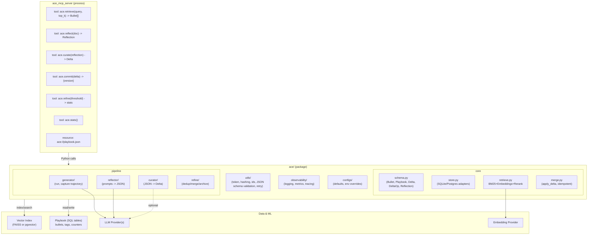

```mermaid
flowchart TB
  subgraph mcp["ace_mcp_server (process)"]
    API1["tool: ace.retrieve(query, top_k) -> Bullet[]"]
    API2["tool: ace.reflect(doc) -> Reflection"]
    API3["tool: ace.curate(reflection) -> Delta"]
    API4["tool: ace.commit(delta) -> {version}"]
    API5["tool: ace.refine(threshold) -> stats"]
    API6["tool: ace.stats()"]
    RES1["resource: ace://playbook.json"]
  end

  subgraph lib["ace/ (package)"]
    subgraph core["core"]
      SCH["schema.py\n(Bullet, Playbook, Delta, DeltaOp, Reflection)"]
      STORE["store.py\n(SQLite/Postgres adapters)"]
      RETR["retrieve.py\nBM25+Embeddings+Rerank"]
      MERG["merge.py\n(apply_delta, idempotent)"]
    end
    subgraph pipeline["pipeline"]
      GEN["generator/\n(run, capture trajectory)"]
      REFL["reflector/\n(prompts -> JSON)"]
      CURR["curator/\n(JSON -> Delta)"]
      RFN["refine/\n(dedup/merge/archive)"]
    end
    UTIL["utils/\n(token, hashing, ids, JSON schema validation, retry)"]
    OBS["observability/\n(logging, metrics, tracing)"]
    CFG["configs/\n(defaults, env overrides)"]
  end

  subgraph data["Data & ML"]
    PB["Playbook (SQL tables)\n bullets, tags, counters"]
    VEC["Vector Index\n(FAISS or pgvector)"]
    EMB["Embedding Provider"]
    LLM["LLM Provider(s)"]
  end

  mcp -->|Python calls| lib
  lib -->|read/write| PB
  lib -->|index/search| VEC
  RETR --> EMB
  GEN --> LLM
  REFL --> LLM
  CURR -.optional.-> LLM
```