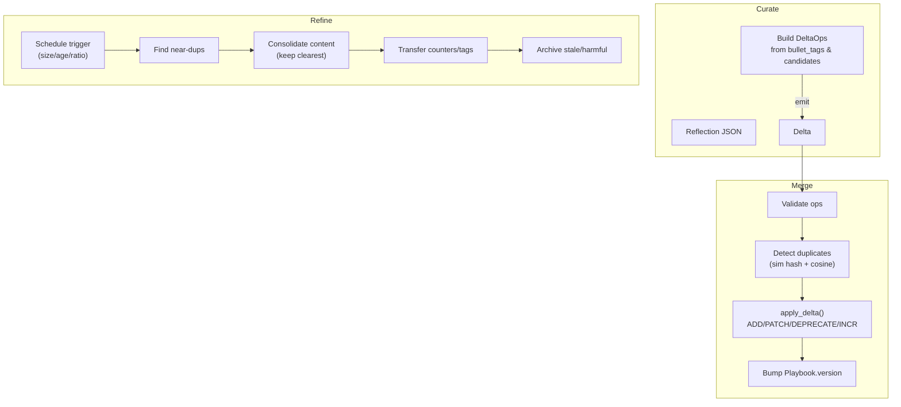

```mermaid
flowchart TB
  subgraph Curate
    R[Reflection JSON]
    D["Build DeltaOps<br/>from bullet_tags & candidates"]
    D -->|emit| Delta
  end

  subgraph Merge
    Delta --> V[Validate ops]
    V --> DED["Detect duplicates<br/>(sim hash + cosine)"]
    DED --> APPLY["apply_delta()<br/>ADD/PATCH/DEPRECATE/INCR"]
    APPLY --> BUMP[Bump Playbook.version]
  end

  subgraph Refine
    S["Schedule trigger<br/>(size/age/ratio)"] --> FIND[Find near-dups]
    FIND --> CONS["Consolidate content<br/>(keep clearest)"]
    CONS --> XFER[Transfer counters/tags]
    XFER --> ARCH[Archive stale/harmful]
  end
```

Determinism: Merge is pure code; any LLM suggestions become structured deltas first.

Idempotency: applying the same Delta twice must yield no change (test it).