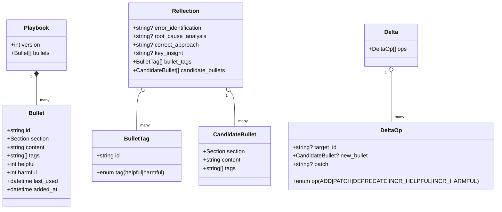

```mermaid
classDiagram
  class Bullet {
    +string id
    +Section section
    +string content
    +string[] tags
    +int helpful
    +int harmful
    +datetime last_used
    +datetime added_at
  }
  class Playbook {
    +int version
    +Bullet[] bullets
  }
  class BulletTag {
    +string id
    +enum tag (helpful|harmful)
  }
  class CandidateBullet {
    +Section section
    +string content
    +string[] tags
  }
  class Reflection {
    +string? error_identification
    +string? root_cause_analysis
    +string? correct_approach
    +string? key_insight
    +BulletTag[] bullet_tags
    +CandidateBullet[] candidate_bullets
  }
  class DeltaOp {
    +enum op (ADD|PATCH|DEPRECATE|INCR_HELPFUL|INCR_HARMFUL)
    +string? target_id
    +CandidateBullet? new_bullet
    +string? patch
  }
  class Delta {
    +DeltaOp[] ops
  }

  Playbook "1" *-- "many" Bullet
  Reflection "1" o-- "many" BulletTag
  Reflection "1" o-- "many" CandidateBullet
  Delta "1" o-- "many" DeltaOp
```