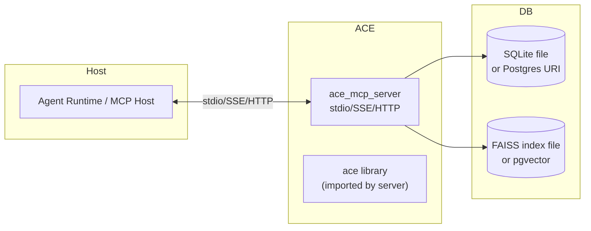

```mermaid
flowchart LR
  subgraph Host
    RT[Agent Runtime / MCP Host]:::sec
  end
  subgraph ACE
    P1["ace_mcp_server<br/>stdio/SSE/HTTP"]:::sec
    P2["ace library<br/>(imported by server)"]
  end
  subgraph DB
    DB1[("SQLite file<br/>or Postgres URI")]
    IDX[("FAISS index file<br/>or pgvector")]
  end
  RT <-- stdio/SSE/HTTP --> P1
  P1 --> DB1
  P1 --> IDX
```
### Env vars (typical)
ACE_DB_URL, ACE_EMBEDDINGS, ACE_RETRIEVAL_TOPK, ACE_REFINE_THRESHOLD, ACE_LOG_LEVEL, MCP_TRANSPORT.