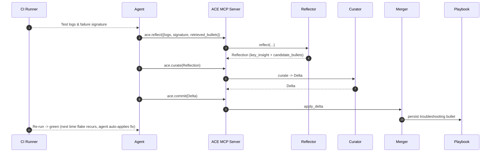

```mermaid
sequenceDiagram
  autonumber
  participant CI as CI Runner
  participant Amp as Agent
  participant MCP as ACE MCP Server
  participant REF as Reflector
  participant CUR as Curator
  participant MER as Merger
  participant PB as Playbook

  CI-->>Amp: Test logs & failure signature
  Amp->>MCP: ace.reflect({logs, signature, retrieved_bullets})
  MCP->>REF: reflect(...)
  REF-->>MCP: Reflection (key_insight + candidate_bullets)
  Amp->>MCP: ace.curate(Reflection)
  MCP->>CUR: curate -> Delta
  CUR-->>MCP: Delta
  Amp->>MCP: ace.commit(Delta)
  MCP->>MER: apply_delta
  MER->>PB: persist troubleshooting bullet
  CI-->>Amp: Re-run -> green (next time flake recurs, agent auto-applies fix)
```
