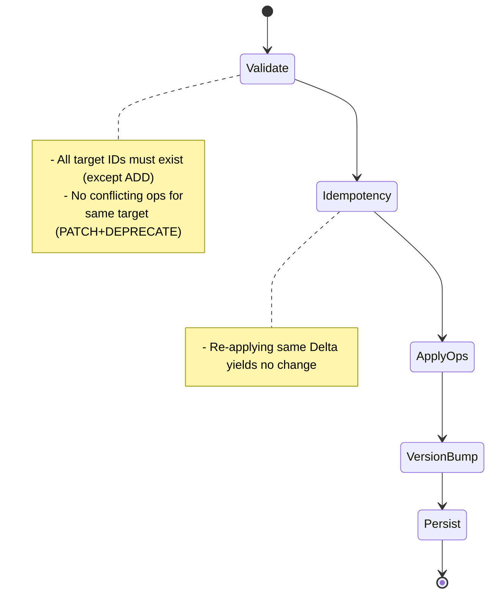
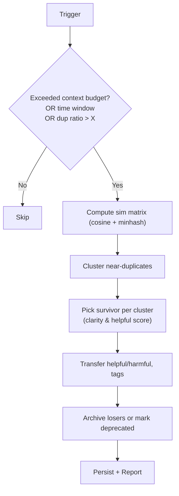

### Delta application invariants

```mermaid
stateDiagram-v2
  [*] --> Validate
  Validate --> Idempotency
  Idempotency --> ApplyOps
  ApplyOps --> VersionBump
  VersionBump --> Persist
  Persist --> [*]

  note right of Validate
    - All target IDs must exist (except ADD)
    - No conflicting ops for same target (PATCH+DEPRECATE)
  end note

  note right of Idempotency
    - Re-applying same Delta yields no change
  end note
```
### Refine policy gates

```mermaid
flowchart TB
  A[Trigger] --> B{"Exceeded context budget?<br/>OR time window<br/>OR dup ratio > X"}
  B -- No --> End[Skip]
  B -- Yes --> C["Compute sim matrix (cosine + minhash)"]
  C --> D[Cluster near-duplicates]
  D --> E["Pick survivor per cluster<br/>(clarity & helpful score)"]
  E --> F[Transfer helpful/harmful, tags]
  F --> G[Archive losers or mark deprecated]
  G --> H[Persist + Report]
```

