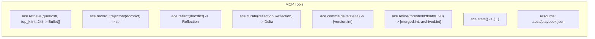

```mermaid
flowchart LR
  subgraph "MCP Tools"
    T1["ace.retrieve(query:str, top_k:int=24) -> Bullet[]"]
    T2["ace.record_trajectory(doc:dict) -> str"]
    T3["ace.reflect(doc:dict) -> Reflection"]
    T4["ace.curate(reflection:Reflection) -> Delta"]
    T5["ace.commit(delta:Delta) -> {version:int}"]
    T6["ace.refine(threshold:float=0.90) -> {merged:int, archived:int}"]
    T7["ace.stats() -> {...}"]
    R1["resource: ace://playbook.json"]
  end
```
### Contracts

Inputs/outputs are strict JSON per the schemas.

ace://playbook.json is read‑only; mutations go via ace.commit.
