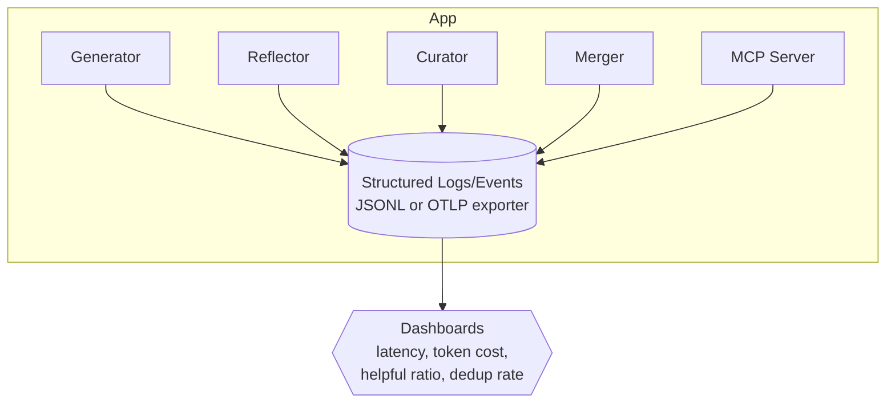

```mermaid
flowchart TB
  subgraph App
    GEN[Generator] --> LOGS
    REF[Reflector] --> LOGS
    CUR[Curator] --> LOGS
    MER[Merger] --> LOGS
    MCP[MCP Server] --> LOGS
  end
  LOGS[(Structured Logs/Events\nJSONL or OTLP exporter)]
  LOGS --> METRICS{{Dashboards\nlatency, token cost,\nhelpful ratio, dedup rate}}
```

### Key metrics

- adaptation_ms, merge_ms, refine_ms, tokens in/out
- retrieval hit rate, duplicate rate, harmful/helpful ratio
- PR time‑to‑green, CI recurrence of identical failures
