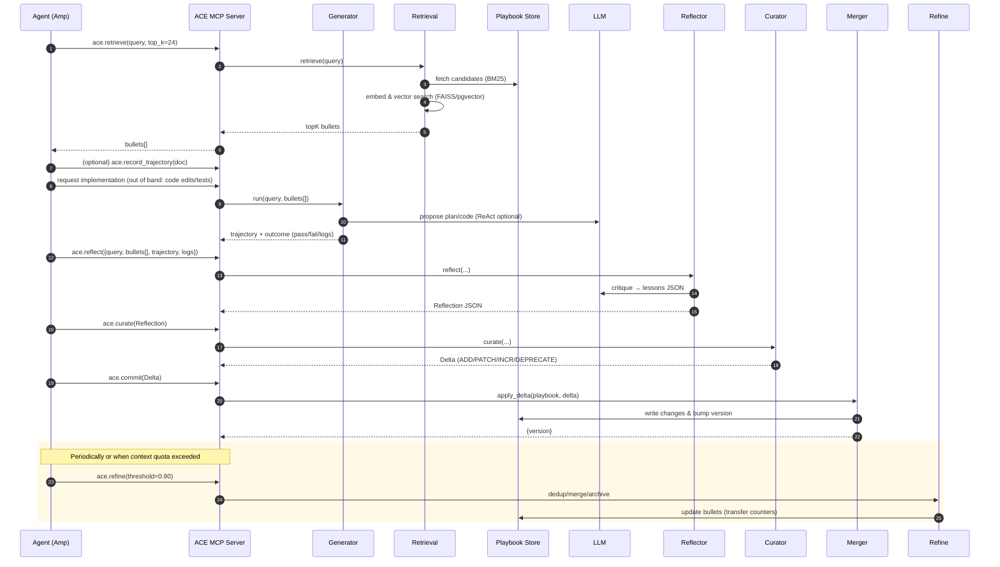

```mermaid
sequenceDiagram
  autonumber
  participant Amp as Agent (Amp)
  participant MCP as ACE MCP Server
  participant GEN as Generator
  participant RET as Retrieval
  participant PB as Playbook Store
  participant LLM as LLM
  participant REF as Reflector
  participant CUR as Curator
  participant MER as Merger
  participant RFN as Refine

  Amp->>MCP: ace.retrieve(query, top_k=24)
  MCP->>RET: retrieve(query)
  RET->>PB: fetch candidates (BM25)
  RET->>RET: embed & vector search (FAISS/pgvector)
  RET-->>MCP: topK bullets
  MCP-->>Amp: bullets[]

  Amp->>MCP: (optional) ace.record_trajectory(doc)
  Amp->>MCP: request implementation (out of band: code edits/tests)
  MCP->>GEN: run(query, bullets[])
  GEN->>LLM: propose plan/code (ReAct optional)
  GEN-->>MCP: trajectory + outcome (pass/fail/logs)

  Amp->>MCP: ace.reflect({query, bullets[], trajectory, logs})
  MCP->>REF: reflect(...)
  REF->>LLM: critique → lessons JSON
  REF-->>MCP: Reflection JSON

  Amp->>MCP: ace.curate(Reflection)
  MCP->>CUR: curate(...)
  CUR-->>MCP: Delta (ADD/PATCH/INCR/DEPRECATE)

  Amp->>MCP: ace.commit(Delta)
  MCP->>MER: apply_delta(playbook, delta)
  MER->>PB: write changes & bump version
  MER-->>MCP: {version}

  rect rgb(255,250,230)
  Note over Amp,MCP: Periodically or when context quota exceeded
  Amp->>MCP: ace.refine(threshold=0.90)
  MCP->>RFN: dedup/merge/archive
  RFN->>PB: update bullets (transfer counters)
  end
```