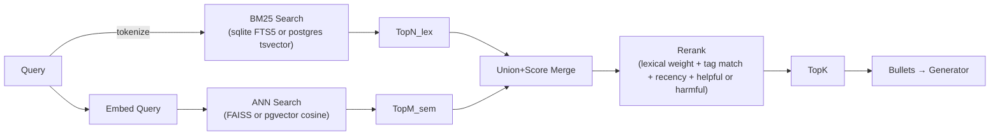

```mermaid
flowchart LR
  Q[Query] -->|tokenize| BM25["BM25 Search<br/>(sqlite FTS5 or postgres tsvector)"]
  Q --> EMB[Embed Query]
  EMB --> ANN["ANN Search<br/>(FAISS or pgvector cosine)"]
  BM25 --> CAND1[TopN_lex]
  ANN --> CAND2[TopM_sem]
  CAND1 --> MERG[Union+Score Merge]
  CAND2 --> MERG
  MERG --> RERANK["Rerank<br/>(lexical weight + tag match + recency + helpful or harmful)"]
  RERANK --> K[TopK]
  K --> OUT[Bullets → Generator]
```

### Scoring Example
final = 0.45*lex + 0.35*sem + 0.10*tag_bonus + 0.05*helpful_ratio + 0.05*recency_decay
