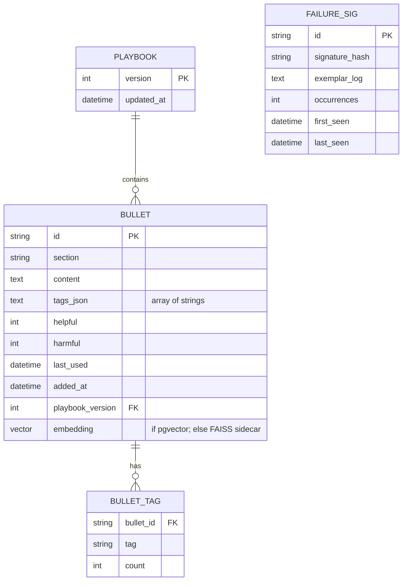

```mermaid
erDiagram
  BULLET ||--o{ BULLET_TAG : has
  PLAYBOOK ||--o{ BULLET : contains

  PLAYBOOK {
    int version PK
    datetime updated_at
  }

  BULLET {
    string id PK
    string section
    text content
    text tags_json  "array of strings"
    int helpful
    int harmful
    datetime last_used
    datetime added_at
    int playbook_version FK
    vector embedding  "if pgvector; else FAISS sidecar"
  }

  BULLET_TAG {
    string bullet_id FK
    string tag
    int count
  }

  %% Optional CI failure signatures for troubleshooting statistics
  FAILURE_SIG {
    string id PK
    string signature_hash
    text exemplar_log
    int occurrences
    datetime first_seen
    datetime last_seen
  }
```